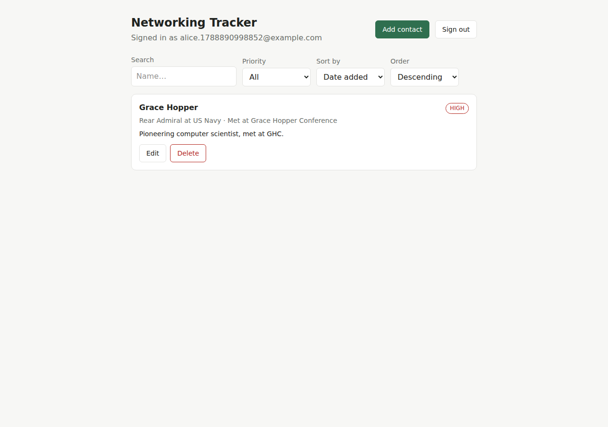
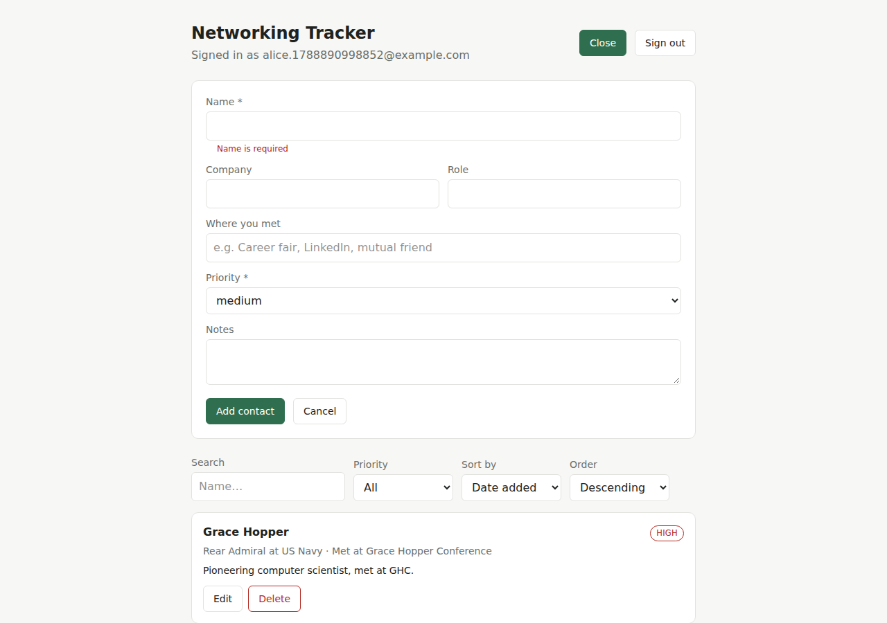
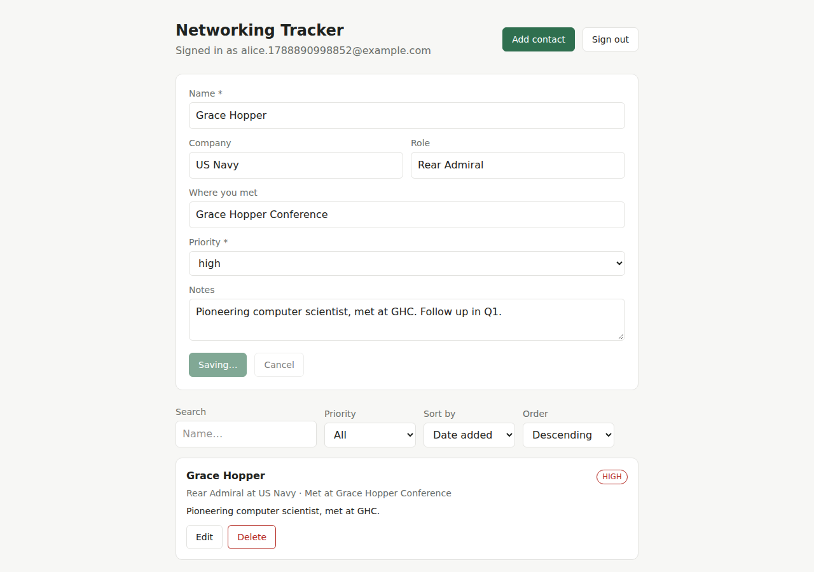
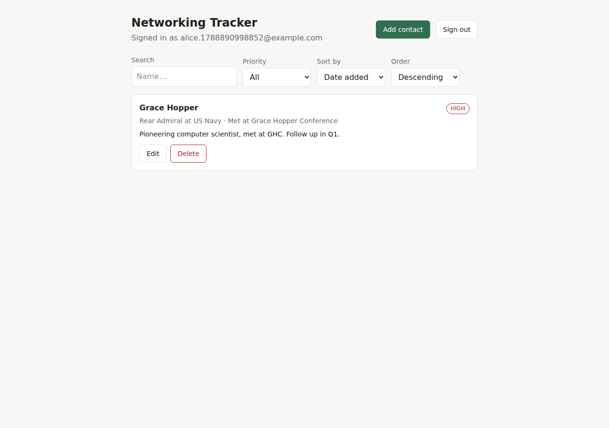
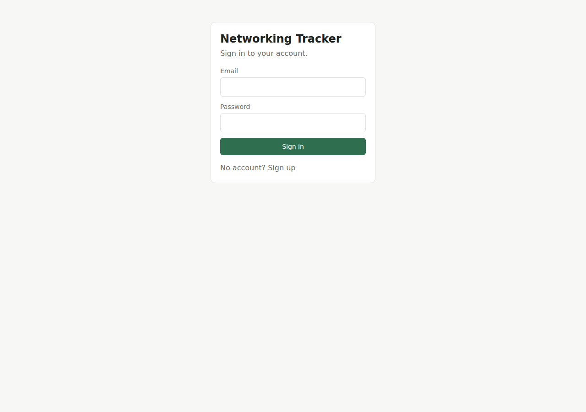
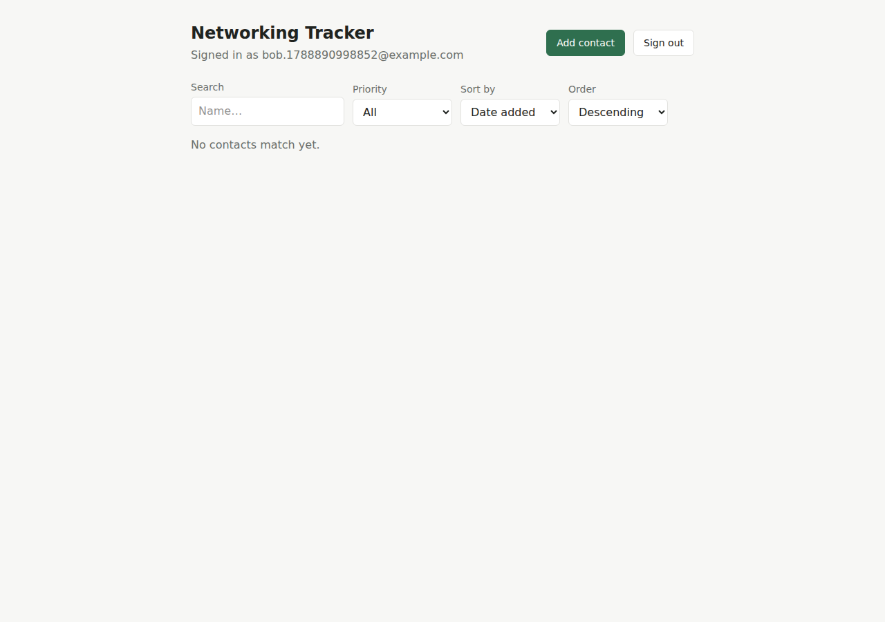
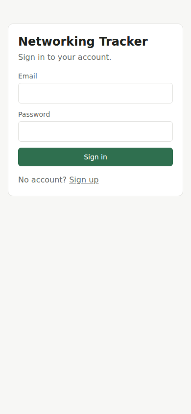
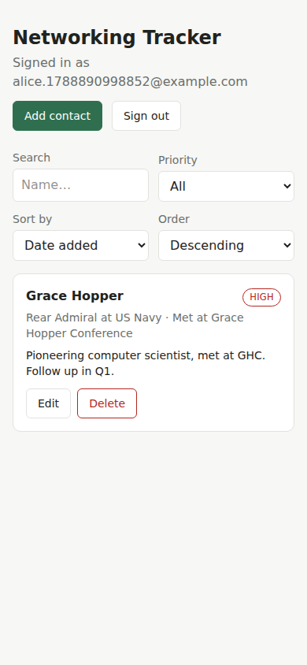

# Networking Tracker

A small, secure app for tracking professional contacts — who you met, where
you met them, their priority, and notes — scoped so each signed-in user only
ever sees their own data. Built on Next.js, Neon Postgres, Managed Better
Auth, and the Neon Data API, and deployed on Vercel.

**Live app:** https://networking-tracker-fawn.vercel.app
(secondary alias: https://networking-tracker-yukahamanaka-2562s-projects.vercel.app)

**Repository:** https://github.com/yhamanaka0123-hub/networking-tracker

## Screenshots / walkthrough

All screenshots below were captured against the **live production URL**
(not localhost) with a headless browser driving the actual app.

| Sign in | Add a contact | Invalid input rejected |
| --- | --- | --- |
|  |  |  |

| Edit a contact | Survives refresh | Sign out |
| --- | --- | --- |
|  |  |  |

**Two-account privacy test** — User A ("alice…") has one contact (Grace
Hopper). A brand-new User B ("bob…"), signed in on a separate session, sees
an empty list — B cannot see A's data:

| User A's contacts | User B's contacts (different account) |
| --- | --- |
|  |  |

**Mobile** (390×844 viewport, live production URL):

| Sign in | Contact list |
| --- | --- |
|  |  |

## Features

- Email/password sign up, sign in, and sign out (Neon Managed Better Auth)
- Add a contact with name, company, role, where you met, notes, and priority
- Priority is restricted to `low`, `medium`, or `high` — enforced twice
  (client validation + database `CHECK` constraint)
- Sortable, filterable contact list (by name, priority, or date added;
  filter by priority; search by name)
- Edit and delete your own contacts
- Contacts persist across a browser refresh (real Postgres storage, not
  local state)
- Clear loading, empty, error, and success states throughout
- Responsive layout that works on both desktop and mobile viewports
- Every contacts row is owned by exactly one user, enforced at the database
  level with Row Level Security — not just in application code

## Technology stack and why

- **Next.js (App Router, TypeScript)** — one project hosts both the React
  frontend and the backend API routes, so there's a single deploy target
  but still a clean frontend/backend separation inside it (see
  [Architecture](#architecture)).
- **Tailwind CSS** — utility-first styling system used for every component
  (`app/globals.css` defines the theme tokens and a small set of reusable
  component classes like `.card`, `.btn`, `.field-input`); chosen for fast,
  consistent, responsive styling without hand-rolling a component library.
- **Neon Postgres** — the persistent data store; chosen because it pairs
  natively with Managed Better Auth and the Data API below, so
  `auth.user_id()` is available directly inside RLS policies with no
  separate auth database to keep in sync.
- **Neon Managed Better Auth** — hosted email/password authentication;
  avoids building or operating auth/session infrastructure ourselves.
- **Neon Data API** — a PostgREST-style HTTP API in front of Postgres that
  respects Row Level Security, letting the browser read contacts directly
  (with a verified JWT) without a hop through our own backend.
- **Zod** — shared validation schema used by both the client form (instant
  feedback) and the API routes (the authoritative check).
- **`pg`** — plain parameterized SQL from the backend's Route Handlers,
  connecting as the table owner for the write path.
- **Vitest** — fast, native-ESM test runner for the validation schema.
- **Vercel** — zero-config hosting for Next.js (App Router, Route Handlers,
  and static assets all deploy from `next build` with no extra config).
- **Git / GitHub** — source control and the single deliverable for grading.

## Architecture

One Next.js (App Router, TypeScript) app, deployed as a single Vercel
project, with a clear frontend/backend split inside it:

```
Browser (React) ──reads (list/sort/filter)──▶ Neon Data API ──▶ Postgres (RLS-gated)
      │                                                              ▲
      │ writes (create/edit/delete), Bearer JWT                     │
      ▼                                                              │
Next.js Route Handlers (app/api/contacts/*) ──validated writes───────┘
      │ verifies JWT via JWKS               (parameterized SQL, pg)
      ▼
Neon Auth JWKS (NEON_AUTH_JWKS_URL)
```

- **Frontend** (`app/`, `components/`) — sign up/in/out and session state,
  plus **reads** (list, sort, filter), all done directly against the Neon
  Data API from the browser via `@neondatabase/neon-js`'s two-URL object
  form (`lib/neonClient.ts`):
  ```ts
  createClient({
    auth: { url: NEXT_PUBLIC_NEON_AUTH_URL },
    dataApi: { url: NEXT_PUBLIC_NEON_DATA_API_URL },
  });
  ```
  Row Level Security is what makes reading straight from the browser safe:
  a signed-in user's token only ever matches `auth.user_id() = user_id`
  rows.

- **Backend** (`app/api/contacts/route.ts`, `app/api/contacts/[id]/route.ts`)
  — **all writes** (create, edit, delete). Each handler:
  1. Reads the caller's `Authorization: Bearer <jwt>` header and verifies
     it locally against Neon Auth's JWKS (`lib/session.ts`, using `jose`) —
     the same trust boundary the Data API itself uses. The verified
     `sub` claim is the real user id; nothing from the request body is
     ever trusted for identity.
  2. Validates the body with a shared Zod schema (`lib/contactSchema.ts`)
     — required `name`, `priority` restricted to `low | medium | high`.
  3. Runs a parameterized query via `pg` (`lib/db.ts`) against the pooled,
     **server-only** `DATABASE_URL`, explicitly scoping every
     `UPDATE`/`DELETE` with `WHERE user_id = $verifiedId`. This connection
     is the Postgres owner role, which bypasses RLS by default — the
     backend enforces ownership itself here, and RLS remains the real
     gate for the separate Data API path the browser uses.

  **Why a Bearer JWT and not the session cookie:** Managed Better Auth's
  session cookie is scoped to the Auth service's own origin
  (`*.neonauth.*.neon.tech`), not this app's origin, so it never reaches
  these Route Handlers. Instead the frontend (`lib/authToken.ts`) fetches a
  short-lived JWT directly from the Auth service
  (`GET {authUrl}/get-session`, reading the `set-auth-jwt` response header
  — same-origin as that cookie) and sends it as a Bearer token on every
  call to our own API.

- **Database** (`db/schema.sql`) — see [Schema](#schema) below.

**Why writes don't also go through the Data API:** the browser client's
automatic token injection is designed for the browser's own requests, and
forwarding that same token into a second, server-side Data API client
isn't a documented pattern for the current (beta) SDK. Routing writes
through our own Route Handlers is simpler, still fully secure (RLS still
gates the Data API for any other caller, and did in testing — see
[Security](#security)), and is the natural "backend logic" half of the
split.

## Local setup

### Prerequisites

- Node.js 22+
- A Neon project with a `neon.ts` already declaring `auth: true` and
  `dataApi: true` (see [`neon.ts`](./neon.ts)), linked via `neon link`.

### Install and configure

```bash
git clone https://github.com/yhamanaka0123-hub/networking-tracker.git
cd networking-tracker
npm install
cp .env.example .env.local
```

Fill in `.env.local` from your linked branch's env (`neon deploy` or
`neon env pull` writes `DATABASE_URL`, `DATABASE_URL_UNPOOLED`,
`NEON_AUTH_BASE_URL`, `NEON_AUTH_JWKS_URL`, and `NEON_DATA_API_URL` — copy
`NEON_AUTH_BASE_URL` into `NEXT_PUBLIC_NEON_AUTH_URL`, `NEON_DATA_API_URL`
into `NEXT_PUBLIC_NEON_DATA_API_URL`, and keep `NEON_AUTH_JWKS_URL` as-is).
Note that `neon deploy` / `neon env pull` will overwrite `.env.local` with
the raw `NEON_*` names again on a future run — re-copy the two
`NEXT_PUBLIC_` mirrors afterward.

Allow local sign-in/sign-up during development (Neon Auth only accepts
requests from trusted origins):

```bash
neon neon-auth domain allow-localhost enable
```

### Apply the schema

```bash
npm run db:migrate
```

Applies [`db/schema.sql`](./db/schema.sql) — the `contacts` table, RLS, and
grants — to the linked branch via `DATABASE_URL_UNPOOLED`. Safe to re-run
(it uses `IF NOT EXISTS`/`IF EXISTS` guards throughout, including for the
`met_where` column migration).

### Run it

```bash
npm run dev
```

Open http://localhost:3000, sign up, and start adding contacts.

## Environment variables

See [`.env.example`](./.env.example) for the full list with placeholder
values. Only the two `NEXT_PUBLIC_` values are safe to expose to the
browser — everything else is server-only:

| Variable | Exposed to browser? | Purpose |
| --- | --- | --- |
| `NEXT_PUBLIC_NEON_AUTH_URL` | Yes | Neon Auth service base URL (public endpoint) |
| `NEXT_PUBLIC_NEON_DATA_API_URL` | Yes | Neon Data API base URL (public endpoint) |
| `NEON_AUTH_JWKS_URL` | No (server-only) | Public-key endpoint the backend uses to verify Bearer JWTs |
| `DATABASE_URL` | No (server-only, secret) | Pooled Postgres connection, used by API routes |
| `DATABASE_URL_UNPOOLED` | No (server-only, secret) | Direct Postgres connection, used only by `scripts/migrate.mjs` |

This implementation authenticates writes with a verified Bearer JWT rather
than a session cookie (see [Architecture](#architecture)), so it has no
`NEON_AUTH_COOKIE_SECRET` to manage — there is no cookie-signing step on
this app's own origin.

## Schema

```sql
CREATE TABLE contacts (
  id bigserial PRIMARY KEY,
  user_id text NOT NULL DEFAULT auth.user_id(),
  name text NOT NULL CHECK (btrim(name) <> ''),
  company text,
  role text,
  met_where text,
  notes text,
  priority text NOT NULL DEFAULT 'medium' CHECK (priority IN ('low', 'medium', 'high')),
  created_at timestamptz NOT NULL DEFAULT now(),
  updated_at timestamptz NOT NULL DEFAULT now()
);
```

Full file, including RLS policies and grants: [`db/schema.sql`](./db/schema.sql).

| Column | Notes |
| --- | --- |
| `id` | Primary key |
| `user_id` | Owner of the row; `text`, `NOT NULL`, defaults to `auth.user_id()` — the caller's verified id from their Data API JWT, used when a Data API caller inserts without specifying it |
| `name` | Required; `CHECK (btrim(name) <> '')` rejects empty/whitespace-only names |
| `company` | Optional |
| `role` | Optional |
| `met_where` | Optional — where you met this person |
| `notes` | Optional |
| `priority` | Required; `CHECK (priority IN ('low','medium','high'))`; defaults to `'medium'` |
| `created_at` / `updated_at` | Set by the app (no trigger); the backend sets `updated_at = now()` on every edit |

## Security

- **The `user_id` ownership column.** `user_id` is `text NOT NULL DEFAULT
  auth.user_id()` — every row is owned by exactly one user and can never be
  null.
- **Row Level Security.** `contacts` has RLS enabled with four separate
  ownership policies for `authenticated` callers — `select`, `insert`,
  `update`, `delete` — each `USING (auth.user_id() = user_id)`, and
  `insert`/`update` additionally `WITH CHECK (auth.user_id() = user_id)` —
  so a caller can't even insert or retarget a row to someone else's
  `user_id`.
- **Two-account isolation, proven programmatically against the live
  deployment** (fresh accounts, run against
  `https://networking-tracker-fawn.vercel.app`):

  ```
  User A id: 243f6042-6105-44bc-8daf-2ca4bc9bc000
  User B id: 1e97b893-db2e-4826-9f36-f57baf5d8ec7

  [1] A creates contact via backend -> 201 {"id":"14","name":"Isolation Test Contact", ...}

  [2] B reads A's contact via Data API -> 200 [] (expected: [])

  [3] B PATCHes A's contact via backend -> 404 {"error":"Contact not found."} (expected: 404)

  [4] B DELETEs A's contact via backend -> 404 {"error":"Contact not found."} (expected: 404)

  [5] B inserts forged user_id via raw Data API -> 403 {"code":"42501","message":"new row violates row-level security policy for table \"contacts\""} (expected: 403 RLS violation)

  [6] A re-reads own contact -> 200 [{"id":14, "user_id":"243f6042-...", "name":"Isolation Test Contact", ...}]
  ```

  In plain terms: User B's Data API read of User A's contact returns
  nothing (RLS filters the row out entirely, rather than returning a
  permission error); User B's PATCH/DELETE through our own backend both
  return `404` (the `WHERE id = $id AND user_id = $verifiedId` clause
  matches zero rows); a raw Data API insert where User B tries to forge
  `user_id` to User A's id is rejected outright with Postgres error `42501`
  (RLS policy violation) — the `WITH CHECK` clause on the insert policy.
  User A's data is confirmed untouched throughout. See also the screenshots
  above (`two-account-userA.png` / `two-account-userB.png`) for the
  same result at the UI level.
- **Required-field and priority validation, in two independent layers:**
  - *Trusted server code* — `lib/contactSchema.ts` (Zod), enforced in the
    Route Handlers before any write, returning clear `400` errors. See the
    "invalid input" screenshot above: submitting a blank name shows "Name
    is required" without ever reaching the server.
  - *Trusted database code* — `NOT NULL` / `CHECK` constraints in
    `db/schema.sql`. This is the layer that actually can't be bypassed:
    the Data API is a public REST endpoint reachable directly by anyone
    holding a valid session token, entirely outside our Next.js server.
    A raw Data API insert with `priority: "urgent"` or a blank `name` is
    rejected with Postgres error `23514` (check constraint violation),
    independent of the Zod layer.
- **Identity is never trusted from client input.** The backend derives the
  acting user id by cryptographically verifying the caller's JWT against
  Neon Auth's JWKS (`lib/session.ts`); it never reads a `user_id` field
  from a request body.
- **Secrets stay server-only.** `DATABASE_URL` and `DATABASE_URL_UNPOOLED`
  are read only in `lib/db.ts` and `scripts/migrate.mjs`, never prefixed
  `NEXT_PUBLIC_`, and `.env.local` is gitignored — confirmed no secret
  values are present anywhere in this repository's Git history. The two
  `NEXT_PUBLIC_*` values (Auth and Data API URLs) and the JWKS URL are not
  secrets — they're the same kind of public endpoint identifiers Neon
  documents for direct HTTP/Data API use — but `NEON_AUTH_JWKS_URL` is
  still kept server-only since only the backend needs it.
- `.env.example` contains placeholder values only.

## Testing

```bash
npm test
```

Runs [`tests/contactSchema.test.ts`](./tests/contactSchema.test.ts) (Vitest)
against the shared Zod schema: accepts valid input, rejects a missing or
whitespace-only `name`, rejects an invalid `priority`, and rejects a
missing `priority`. This is the same schema the API routes import, so it
covers the actual validation logic rather than a reimplementation of it.

**Output:**

```
> networking-tracker@0.1.0 test
> vitest run

 RUN  v4.1.11 /home/yhamanaka/code/networking-tracker

 Test Files  1 passed (1)
      Tests  5 passed (5)
   Start at  11:10:56
   Duration  340ms
```

The full read/write/RLS/JWT flow was additionally exercised end-to-end
against the **live production deployment**: sign-up, JWT retrieval,
create/list/sort/filter/edit/delete, refresh persistence, the invalid-input
case, and the cross-user isolation cases — see [Security](#security) and
the screenshots above for what those runs confirmed.

## Deployment (Vercel)

**Currently deployed at:**
- https://networking-tracker-fawn.vercel.app
- https://networking-tracker-yukahamanaka-2562s-projects.vercel.app

(Project `yukahamanaka-2562s-projects/networking-tracker`; both domains are
stable production aliases Vercel assigned and both are registered as
trusted Neon Auth origins.)

To deploy (or redeploy) yourself:

1. `vercel link` the project (or push to GitHub and import it in the
   Vercel dashboard).
2. Set the production environment variables — `DATABASE_URL` and
   `DATABASE_URL_UNPOOLED` as **Secret** (`--sensitive` / mark sensitive in
   the dashboard), `NEXT_PUBLIC_NEON_AUTH_URL` and
   `NEXT_PUBLIC_NEON_DATA_API_URL` as **Config** (Vercel will refuse a bare
   `NEXT_PUBLIC_` add if the value looks credential-shaped — that's
   expected; these two are intentionally public endpoint URLs, so pass
   `--type config`), and `NEON_AUTH_JWKS_URL`:
   ```bash
   vercel env add DATABASE_URL production --sensitive
   vercel env add DATABASE_URL_UNPOOLED production --sensitive
   vercel env add NEXT_PUBLIC_NEON_AUTH_URL production --type config
   vercel env add NEXT_PUBLIC_NEON_DATA_API_URL production --type config
   vercel env add NEON_AUTH_JWKS_URL production
   ```
3. `vercel deploy --prod`. Vercel auto-detects Next.js and runs
   `next build` / serves with `next start` — no custom build config
   needed.
4. Trust the resulting domain(s) with Neon Auth, or sign-in/sign-up will
   fail with an `invalid domain` error (check all aliases Vercel assigns —
   `vercel inspect <deployment-url>` lists them — not just the one printed
   as "Production"):
   ```bash
   neon neon-auth domain add https://your-app.vercel.app
   ```
   Repeat for any custom domain and for preview deployment URLs you use.
5. If you deploy a different Neon branch per Vercel environment (e.g. a
   preview branch per PR), re-run `npm run db:migrate` against that
   branch's `DATABASE_URL_UNPOOLED` before traffic hits it.

**Gotcha hit during this deployment:** `neon.ts` imports
`@neon/config/v1`. Locally that package can be present in `node_modules`
from having run the Neon CLI's `neon config init` without ever being added
to `package.json` — `next build`'s type-check then silently passes locally
(and can even keep passing off a stale `tsconfig.tsbuildinfo` after the
package is gone) but fails on Vercel's clean checkout with
`Cannot find module '@neon/config/v1'`. Fix: `@neon/config` is listed as a
real `devDependency` here (see `package.json`) — if you regenerate
`neon.ts` from scratch elsewhere, make sure `@neon/config` is an actual
project dependency, not just a global/ambient install.

## Known limitations and what's next

- **No pagination.** `ContactsApp` loads all of a user's contacts in one
  Data API call. Fine at personal-networking scale (dozens to low
  hundreds of contacts); would need cursor-based pagination or infinite
  scroll for much larger lists.
- **No optimistic UI updates.** Every create/edit/delete triggers a full
  `load()` re-fetch rather than updating local state directly — simpler
  and always-consistent, at the cost of a brief extra round-trip.
- **Single free-text `met_where` field**, not a structured "event" entity.
  Good enough for "Career fair" or "LinkedIn"; a future version could turn
  this into its own table if users wanted to group contacts by event.
- **No password reset / email verification flow** wired up in this UI —
  Managed Better Auth supports it, but it wasn't in scope for this
  assignment.
- **No CSV import/export or bulk actions** — contacts are added one at a
  time.
- **Next step I'd prioritize:** debounced search-as-you-type against the
  Data API (currently every keystroke re-queries) and a confirmation
  toast/undo for deletes instead of a blocking `confirm()` dialog.

## Project layout

```
app/
  page.tsx                 Session-gated entry: sign-in/up panel or the app
  globals.css               Tailwind entry point + theme tokens + component classes
  api/contacts/route.ts    POST — create (backend)
  api/contacts/[id]/route.ts  PATCH/DELETE — edit, delete (backend)
components/                 Frontend: auth panel, contact list/form, sort/filter bar
lib/
  neonClient.ts             Browser Neon client (auth + Data API reads)
  authToken.ts               Fetches/caches the Bearer JWT for backend calls
  session.ts                 Backend: verifies that JWT via JWKS
  contactSchema.ts           Shared Zod validation (client + backend)
  db.ts                      Server-only pg pool
db/schema.sql                Table, RLS policies, grants
scripts/migrate.mjs          Applies db/schema.sql
tests/contactSchema.test.ts  Automated test
docs/screenshots/            README evidence screenshots
```
